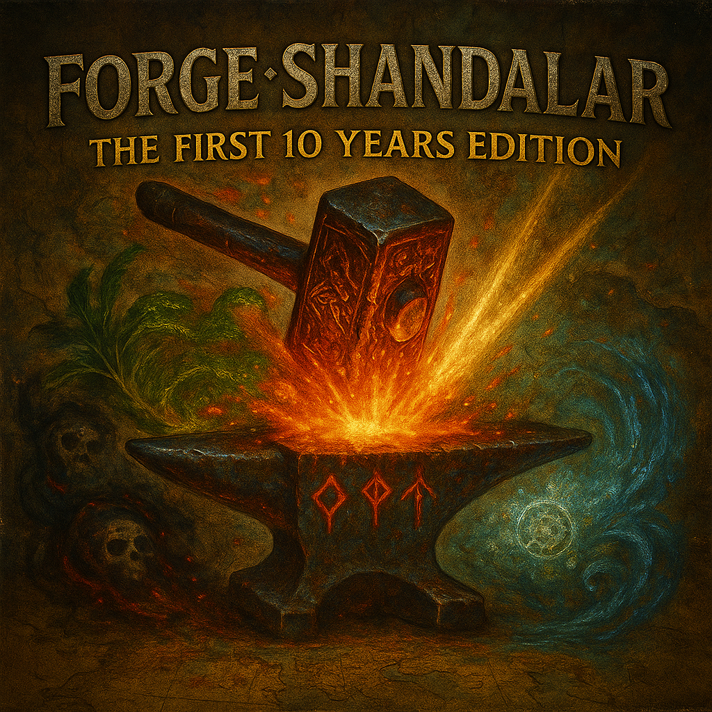
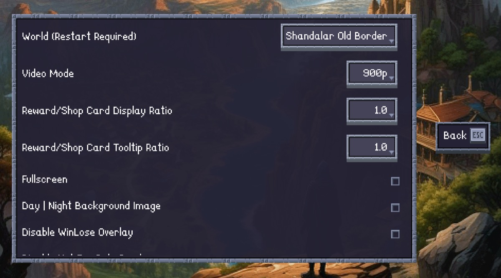

# Old-Border Shandalar for Forge - Repository Moved

## This Repository Has Moved

**Development has moved to: [github.com/vanja-ivancevic/forge](https://github.com/vanja-ivancevic/forge)**

Visit the new repository for:
- **Latest beta snapshots** of the Old-Border Shandalar mod
- Early access to new features and fixes
- Issue tracking and discussions

Full updates will be pushed to the [official Forge repository](https://github.com/Card-Forge/forge) after reviews.

---

Huge thanks to **Shenshinoman** for creating the "planes" system that made this possible!

## How to Play

**Note:** The beta fork does not contain built files. To use the latest beta version:

1.  Download the mod files from the [new repository](https://github.com/vanja-ivancevic/forge/tree/master/forge-gui/res/adventure/Shandalar%20Old%20Border).
2.  Manually replace your `/res/adventure/Shandalar Old Border/` folder with the downloaded files.
3.  In Forge, go to **Adventure Mode > New Game > Settings**.
4.  Select the **"Shandalar Old Border"** plane.
5.  Restart the game and start your adventure!

Happy dueling!